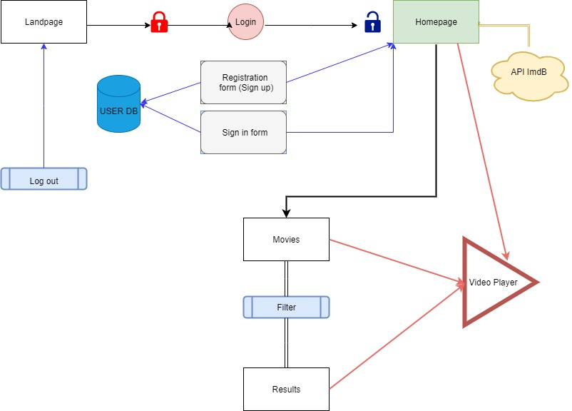
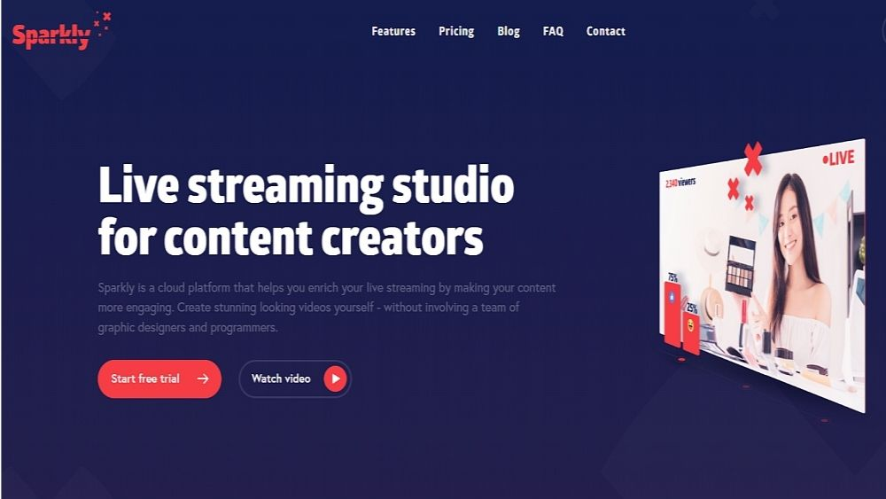

# Welcome to Getflix

**The live site:** ...

## Contents

1. The project
2. Planning & Organisation
3. Timeline
4. Concept evolution
5. Resources
6. Acknowledgements
7. 
8. 
9.
10. 

## The project

this project is.... 

### Aim

The aim of this project is to.....

[Project challenge description](https://github.com/becodeorg/BXL-Swartz-3-21/blob/master/06-PHP/getflix_project.md)

### Features

#### Landing page

* **Sign Up** button leading to *Sign Up* page
* **Log in** button leading to *login* page

#### Home page

* **Navigation bar** for ease of traversing through the site
 * **Log out** option, ending the session and returning to the *landing page*
* **Search bar** to search for videos or genres
* **6 categories** of videos for the user to browse
* A **sample of videos** for each category leading to the *video player page*
* **Footer section** with logo, sitemap and contact details

#### Sign up / login page

#### Results page

#### Video player page

#### Other

* A fully functioning **database** hosting two tables of information
      * The videos per category
      * User credentials
* Use of a **Session**

### Practices

security.... 
mobile first... 

## Planning & Organisation

### Project team

* Nicolas Saeys
* Khadija El Khadri
* Mathieu Herbos
* Ashleigh Templeton

### Task management & project handling

The development team utilised scrum methodology to manage the project tasks. 
They used:
* Trello to manage the development process of key tasks;
* Figma to update the web design;
* Google docs to share resources, login details, notes, etc.;
* Discord for communication

A morning and afternoon meeting were held each day to ensure active communication on the progress of tasks and common understanding of the project's direction. Meetings were also held in the afternoon and when needed throughout the day between members and the group. 
Each team member was always connected to their discord vocal channel in case help or clarification was ever needed. 

### Site Map

The site is constructed as follows:

* The user will arrive at the landing page
* They will then choose to either sign up or login
      * arrive at sign up page
      * arrive at login page
* From the signup or login page, they will be redirected to the main home page, from here there are multiple options
      * If logout selected
            * arrive at landing page
      * If search launched
            * arrive at results
      * If video selected
            * arrive at video page
      * If category selected
            * arrive at category / filter page
                  * If filtered
                             * arrive at results
                                       * if video selected
                                                   * arrive at video page
                  * If video selected
                             * arrive at video page
      * If video selected
                  * arrive at video page
  

### Tools

##### Front End

* Bootstrap framework
* 
* 

## Timeline

### Proposed timeline

### Completed stages

## Concept evolution

### Early stages

We based the idea of our landing index page on the following concept:

The first concept/template of the home page, of which we made the initial database and JS tests with, was made with bootstrap

*Inspiration for the design of this site was taken from Netflix*

### Mid project

### End project

### Final product

## Resources

### Tools

* Site and database hosting: [000webhostapp](https://getflixproject.000webhostapp.com/)
* Web design: [Figma](https://www.figma.com/file/SKbeGU18QARlioaiViQ1QC/Wireframing-in-Figma?node-id=0%3A1)

### Planning

* [Google drive](https://drive.google.com/drive/folders/1a0ARVjYfVONoEEJ0cyo1g8SgQP3uow1h)
* [Google docs](https://docs.google.com/document/d/1zTGTB1Wex38f49HAybjMgSLT_Fui4-lMY2wOzgB0zfg/edit)
* [Trello](https://trello.com/b/7vgFR6nC/php-work)

### Youtube videos

 *
 *
 *
 *
 *
 *
 *
 *
 *
 *
 *
 *
 *
 *
 *
 *
 *
 *
 *
 *
 *
 *
 *
 *

## Acknowledgements

We would like to thank..... 

