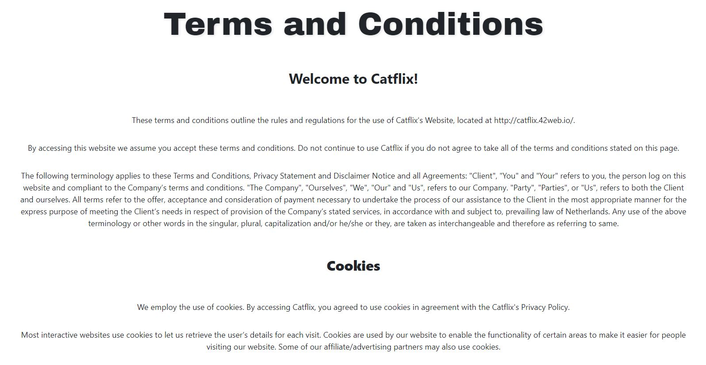

# Welcome to Getflix

**The live site:** http://catflix.42web.io

## Contents

1. The project
2. Planning & Organisation
3. Timeline
4. Concept evolution
5. Resources
6. Acknowledgements

## The project

We were tasked with developing a live streaming platform similar to Netflix incorperating the languages, tools and frameworks we had learnt so far at BeCode, importantly PHP. 

To accomplish this, we had to achieve the following base criteria:

* A session system: registration, connection / disconnection.
* Different rights: registrants have the right to comment on the content. You can add other rights depending on the different types of users.
* Include a search bar and sort by filters
* Make a secure code
* Deploy the site. PHP is not supported by github, find free alternatives.

[Full project description](https://github.com/becodeorg/BXL-Swartz-3-21/blob/master/06-PHP/getflix_project.md)

### Aim

The aim of this project is to consolidate our knowledge of PHP and bring together our other language knowledge by developing a streaming platform.

### Features

#### Landing page (index.html)

- **Sign Up** button leading to _Sign Up_ page
- **Log in** button leading to _login_ pages

#### Sign up page

- Make a new account
- Password confirmation for security
- Password length of 8 char requirements
- Email verification
- Name, username and password constraints to secure code
- Option for premium access
- A beautiful cat picture

#### Login page

- **Login** with _username_ or _email_
- User name and password _verification_

#### Home page

- **Navigation bar** for ease of traversing through the site
- **Log out** option, ending the session and returning to the _landing page_
- **Search bar** to search for videos
- **3 genres** of videos for the user to browse
  - with A **sample of videos** for each category leading to the _streaming page_
- Mobile and touch friendly carousels
- **Footer section** with links to T&Cs and FAQs

#### Results page

- View **all results** from the search
- A **grumpy cat** result when _no page is found_

#### Streaming page

- **Fully responsive** youtube streaming
- **Movie information** (description, year, rating)
- **Comments section** for _each_ video

#### Filtered pages

- A **full page per genre** to display all videos for that genre
- A page for _all movies_
- **Best Rated movies** displaying the currently best rated movies using TmDB api

#### Other

- Separate Terms and Conditions page
- Separate FAQ page
- A fully functioning **database** hosting three tables of information
  _ The videos per category
  _ User details
  _ Comments for each video 
- Use of a **Session** Log in and log out
- Monthly newsletter

### Practices

#### Security

- Prepared statements
- Password hashing
- Password restriction by length
- Password confrimation (repeating the password entered)
- Limiting characters able to be sent to the database
- Passing entered data as a string/ changing html characters so that it cannot be considered code
- Only letters can be considered for names
- Only letters and numbers can be considered for user names
- POST instead of GET requests where for user inputs

#### Design

- Mobile first approach

## Planning & Organisation

### Project team

- Nicolas Saeys
- Khadija El Khadri
- Mathieu Herbos
- Ashleigh Templeton

### Task management 

_Common tasks_

* Design with Figma
* Database establishment
* Merging, file management, testing
* Final styling 

_Other tasks_

- [x] Research hosting site - Mathieu & Nicolas
- [x] User management: backend - Ashleigh
- [x] User management: frontend - Khadija
- [x] Page design: Landing, signup, login, results - Nicolas
- [x] Page design: Navbar & Footer - Khadija
- [x] Page design: Home - Ashleigh
- [x] Page design: Streaming - Mathieu
- [x] Overall design, style harmonisation & upkeep - Nicolas
- [x] Search function - Khadija
- [x] Comments section - Ashleigh 
- [x] Fetch & displaly API data (TMDb) - Khadija 
- [x] Filtering by genre - Khadija
- [x] Newsletter - Ashleigh

### Process

The development team utilised scrum methodology to manage the project tasks.
They used:

- Trello to manage the development process of key tasks;
- Figma to update the web design;
- Google docs to share resources, login details, notes, etc.;
- Discord for communication

A morning and afternoon meeting were held each day to ensure active communication on the progress of tasks and common understanding of the project's direction. Meetings were also held in the afternoon and when needed throughout the day between members and the group.
Each team member was always connected to their discord vocal channel in case help or clarification was ever needed.

Below is an example of a debrief defining the tasks for the next day:

### Site Map

The site is constructed as follows:

- The user will arrive at the landing page
- They will then choose to either sign up or login
  - arrive at sign up page
  - arrive at login page
- From the signup or login page, they will be redirected to the main home page, from here there are multiple options
  - If logout selected
    - arrive at landing page
  - If search launched
    - arrive at results
      - If video selected
        - arrive at streaming page
  - If category selected from navbar
    - arrive at category / filter page
      - If video selected
        - arrive at streaming page
  - If video selected
    - arrive at streaming page
  - If FAQ selected from footer
    - arrive at FAQ page
  - If Terms and Conditions seleccted from footer
    - arrive at Terms and Conditions page

### Tools

##### Front End

- **Bootstrap** framework for _overall design_
- **Font Awesome** for _icons_
- **Owl** framework for the home.php _carousel_

## Timeline

### Proposed timeline

It was proposed that the must-have features of the site should be mostly complete and deployable by Friday week 2
A preliminary merge of all completed work and git folder organisation occured on Wednesday of the second week. All up to date and integrated work is published here.
All main features of the project should be completed by Wednesday of the third week end of day to leave Thursday to fix any outstanding issues, consolidate the last pieces of the styling, and review the Lighthouse score.

A presentation of the project will occur on the third week of the project.

## Concept evolution

### Early stages

We based the idea of our landing index page on the following concept:

Using trello, we established the following base designs:

_NAV BAR_

_LANDING & STREAMING_

_HOME & SIGNUP/LOGIN_

### Mid project

#### Pages

As we decided on the "Cat" theme, a preliminary design for each page was formed using mainly bootstrap. With the base structure of these made, we were able to create and test our javascript, PHP and SQL code.

#### Database setup

The database setup currently contains 3 tables.

_Youtube_

The YouTube database contains:
 * A youtube link
 * Movie description
 * Movie runtime
 * Movie release date
 * Movie rating (IMDB)
 * Movie image thumbnail

_Users_

To sign up and login/ create a session:

_Comments_

Linked to the youtube and users tables:
IN PROGRESS

#### Other

TheMovieDB.org was implemented and tested in plain HTML:

### Final product

_INDEX_

_SIGN UP_

_LOGIN_

_HOME_

_STREAMING_

_BEST RATED (api)_

_ALL-ACTION-COMEDY-THRILLER_

_SEARCH RESULTS_

_FAQ_

_TERMS AND CONDITIONS_

_NAVBAR_

_FOOTER_

_Newsletter_

## Resources

### Tools

- Site and database hosting: [Infinity Free](https://infinityfree.net/)
- Web design: [Figma](https://www.figma.com/file/SKbeGU18QARlioaiViQ1QC/Wireframing-in-Figma?node-id=0%3A1)
- Web design: [Bootstrap 4](https://getbootstrap.com/)
- Web design - icons: [Font Awesome](https://fontawesome.com/)
- Carousel: [Owl.Carousel.js](https://owlcarousel2.github.io/OwlCarousel2/)
- Top rated movie API [TMDb](https://www.themoviedb.org/documentation/api)
- Newsletter: [Mailchimp](https://mailchimp.com/)

### Planning

- [Google drive](https://drive.google.com/drive/folders/1a0ARVjYfVONoEEJ0cyo1g8SgQP3uow1h)
- [Google docs](https://docs.google.com/document/d/1zTGTB1Wex38f49HAybjMgSLT_Fui4-lMY2wOzgB0zfg/edit)
- [Trello](https://trello.com/b/7vgFR6nC/php-work)

### Images

- [Unsplash](https://unsplash.com/)

### Youtube trailers for movie database

[See in Excel](assets/db/youtubeinfos.csv)

## Acknowledgements

We would like to thank our brain, patience, motivation and everyone's cats.

Thank you to our colleauges for helping us reflect ideas, aiding with problems and keeping us sane.
